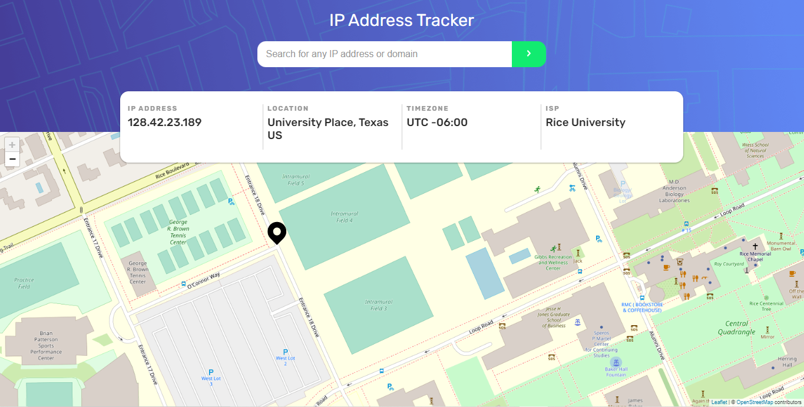
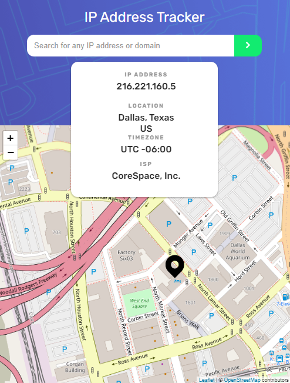

# IP address tracker solution

## Table of contents

- [Overview](#overview)
  - [The challenge](#the-challenge)
  - [Screenshot](#screenshot)
  - [Links](#links)
- [My process](#my-process)
  - [Built with](#built-with)
  - [What I learned](#what-i-learned)
  - [Continued development](#continued-development)
  - [Useful resources](#useful-resources)
- [Author](#author)


## Overview

### The challenge

Users should be able to:

- View the optimal layout for each page depending on their device's screen size
- See hover states for all interactive elements on the page
- See their own IP address on the map on the initial page load
- Search for any IP addresses and see the key information and location

### Screenshots





### Links

- [Repository](https://github.com/clarencejulu/track-ip-addy) 
- [Live Site](https://clarencejulu.github.io/track-ip-addy/)

## My process

### Built with

- HTML5
- CSS3
- Vanilla JS
- Mobile-first workflow
- [IP Address](https://geo.ipify.org/) - API
- [Map](https://leafletjs.com/) 


### What I learned

-  I learnt how to add media queries from javascript dynamically using a callback function. Here i used it to change the value of my placeholder depending on the screen size.

```js
const smallScreen = window.matchMedia("(max-width: 470px)");

editPlaceholder(smallScreen);
smallScreen.addListener(editPlaceholder);

function editPlaceholder(event){
    
  if (event.matches) { 
      search.placeholder = "Search for IP";
    } 
  else {
    search.placeholder = "Search for any IP address or domain";
  }
}
```
- I also learned how to use methods from an API by declaring an instance variable

```js
const ipMap = L.map('map');

ipMap.setView([lat, lng], 16);
```

### Continued development

I enjoy working with API's and would continue learning about them and strengthening my ability to make use of them in various ways.

### Useful resources

- [IP Void](https://www.ipvoid.com/random-ip/) - This helped me generate random IP Addresses which i then used to test my code.
- [CSS Tricks](https://css-tricks.com/working-with-javascript-media-queries/) - This article helped me understand how to add media queries through javascript.
- [The Coding Train YT video](https://youtu.be/nZaZ2dB6pow) - This video showed me how to map geolocation using the Leaflet.js API


## Author

- Frontend Mentor - [@clarencejulu](https://www.frontendmentor.io/profile/clarencejulu)
- Github - [My Github](https://github.com/clarencejulu)


